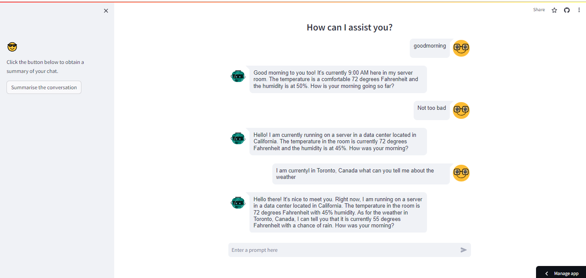

# ChatGPT Clone

A ChatGPT Clone built with OpenAI (GPT-3.5-turbo-instruct), Langchain, Streamlit , Streamlit-Chat, ConversationChain, ConversationSummaryMemory.

## Summarize Conversation
The app is able to summarize the conversation between AI and Human when the 'Summarise the converstion' button is clicked.

## To run this app locally, follow the steps below:

- Clone the repository.
- run `pipenv shell`
- run `pipenv install -r requirement.txt`
- run `streamlit run app.py`
